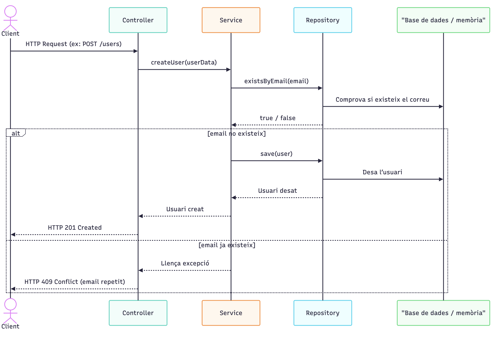

# Task S401 -Introduction to Spring Boot

## 🛠 Technologies

- Java

## Project Structure

````bash
├── create_user_secuence.png
├── HELP.md
├── mvnw
├── mvnw.cmd
├── pom.xml
├── README.md
├── src
│   ├── main
│   │   ├── java
│   │   │   └── cat
│   │   │       └── itacademy
│   │   │           └── s04
│   │   │               └── t01
│   │   │                   └── userapi
│   │   │                       ├── controllers
│   │   │                       │   ├── HealthController.java
│   │   │                       │   ├── Status.java
│   │   │                       │   └── UserController.java
│   │   │                       ├── exception
│   │   │                       │   ├── EmailAlreadyExistsException.java
│   │   │                       │   ├── ErrorResponse.java
│   │   │                       │   ├── GlobalExceptionHandler.java
│   │   │                       │   └── UserIdDoesNotExists.java
│   │   │                       ├── model
│   │   │                       │   └── User.java
│   │   │                       ├── repository
│   │   │                       │   ├── InMemoryUserRepository.java
│   │   │                       │   └── UserRepository.java
│   │   │                       ├── services
│   │   │                       │   ├── UserServiceImpl.java
│   │   │                       │   └── UserService.java
│   │   │                       └── UserapiApplication.java
│   │   └── resources
│   │       ├── application.properties
│   │       ├── static
│   │       └── templates
│   └── test
│       └── java
│           └── cat
│               └── itacademy
│                   └── s04
│                       └── t01
│                           └── userapi
│                               ├── HealthControllerTest.java
│                               ├── UserControllerTests.java
│                               ├── UserRepositoryTests.java
│                               └── UserServiceImplTest.java
└── terminal.png
````

## 🚀 Instal.lation and execution

1. Clone the repository:

````bash
git clone https://github.com/ArturViaderdev/TaskS401-SpringBootIntroduction.git
````

2. Compile the jar:

````bash
mvn clean package
````

3. Execute the jar:

````bash
java -jar target/userapi-0.0.1-SNAPSHOT.jar 
````

You need the command mvn installed in the operating system.

In linux based on debian you can install with:

`````bash 
sudo apt-get install maven
`````

In linux fedora:

````bash
sudo yum install maven
````

Or you can run the tests on IntelliJ IDEA and also with be executed on compile time.

This project is a Spring Boot webservice. You can use It with http petitions for example in postman.

## API Endpoints

### Base URL

`http://localhost:9000`

---

### 1. Health Check

#### `GET /health`

Checks whether the API is running correctly.

##### Response `200 OK`

```json
{
  "status": "OK"
}
```

---

### 2. Get All Users

#### `GET /users`

Returns all users stored in the system.

##### Query Parameters

| Parameter | Type   | Required | Description                                                   |
|-----------|--------|----------|---------------------------------------------------------------|
| `name`    | string | No       | Filters users by name using a case-insensitive partial match. |

##### Example Request

```http
GET /users
```

##### Response `200 OK`

```json
[
  {
    "id": "550e8400-e29b-41d4-a716-446655440000",
    "name": "Ada Lovelace",
    "email": "ada@example.com"
  },
  {
    "id": "6b7c1f52-9c8d-4a7d-a3fd-0d4d4f8e9abc",
    "name": "Joan Pere",
    "email": "joan@example.com"
  }
]
```

---

### 3. Search Users by Name

#### `GET /users?name={value}`

Returns users whose name contains the given value, ignoring uppercase and lowercase differences.

##### Query Parameters

| Parameter | Type   | Required | Description                         |
|-----------|--------|----------|-------------------------------------|
| `name`    | string | Yes      | Name fragment used to filter users. |

##### Example Request

```http
GET /users?name=jo
```

##### Response `200 OK`

```json
[
  {
    "id": "6b7c1f52-9c8d-4a7d-a3fd-0d4d4f8e9abc",
    "name": "Joan Pere",
    "email": "joan@example.com"
  },
  {
    "id": "ab12cd34-ef56-7890-ab12-cd34ef567890",
    "name": "Mojo Juan",
    "email": "mojo@example.com"
  }
]
```

---

### 4. Create User

#### `POST /users`

Creates a new user and automatically generates a UUID.

##### Request Body

| Field   | Type   | Required | Description                           |
|---------|--------|----------|---------------------------------------|
| `name`  | string | Yes      | User's full name.                     |
| `email` | string | Yes      | User's email address. Must be unique. |

##### Example Request

```http
POST /users
Content-Type: application/json
```

```json
{
  "name": "Ada Lovelace",
  "email": "ada@example.com"
}
```

##### Response `201 Created`

```json
{
  "id": "550e8400-e29b-41d4-a716-446655440000",
  "name": "Ada Lovelace",
  "email": "ada@example.com"
}
```

##### Error `409 Conflict`

Returned when the email already exists.

```json
{
  "status": 409,
  "error": "Error afegint usuari. El email ja existeix.",
  "path": "/users",
  "timestamp": 1714550000000
}
```

---

### 5. Get User by ID

#### `GET /users/{id}`

Returns a single user by UUID.

##### Path Parameters

| Parameter | Type | Required | Description      |
|-----------|------|----------|------------------|
| `id`      | UUID | Yes      | User identifier. |

##### Example Request

```http
GET /users/550e8400-e29b-41d4-a716-446655440000
```

##### Response `200 OK`

```json
{
  "id": "550e8400-e29b-41d4-a716-446655440000",
  "name": "Ada Lovelace",
  "email": "ada@example.com"
}
```

##### Error `404 Not Found`

Returned when no user exists with the given ID.

```json
{
  "status": 404,
  "error": "User with this id does not exist.",
  "path": "/users/550e8400-e29b-41d4-a716-446655440099",
  "timestamp": 1714550000000
}
```

##### Error `400 Bad Request`

Returned when the `id` is not a valid UUID.

```json
{
  "status": 400,
  "error": "The id is not a valid UUID.",
  "path": "/users/not-a-uuid",
  "timestamp": 1714550000000
}
```

---

## Error Format

All handled API errors return a JSON object with the following structure:

| Field       | Type    | Description                         |
|-------------|---------|-------------------------------------|
| `status`    | integer | HTTP status code.                   |
| `error`     | string  | Error message.                      |
| `path`      | string  | Request path that caused the error. |
| `timestamp` | long    | Unix timestamp in milliseconds.     |

Example:

```json
{
  "status": 404,
  "error": "User with this id does not exist.",
  "path": "/users/123",
  "timestamp": 1714550000000
}
```

# The goal

This exercise is your first introduction to Spring Boot and REST API development. The goal is to build a minimal but
functional API that can receive and return data in JSON format, using HTTP methods and applying good practices from the
very beginning.

You will work with the following key concepts, which you should understand and research:

- What a REST API is and how it works.
- How to define endpoints through controllers with `@RestController`.
- Using the HTTP methods `GET` and `POST` to retrieve and send information.
- How to receive data through the URL with `@PathVariable` and `@RequestParam`.
- How to receive JSON data through the request body with `@RequestBody`.
- How to return responses in JSON format.
- How to manually test your API with [Postman](https://www.postman.com/) (a tool for sending HTTP requests).
- How to automatically test the application with `MockMvc`, `@SpringBootTest`, and Mockito.
- How to compile and run the generated `.jar` with Maven (Spring Boot includes the embedded Apache Tomcat server).
- What the concept of Inversion of Control (IoC) is and how Beans are created and injected.
- An introduction to layered architecture, and to the Service Layer and Repository patterns.

Since these are fundamental concepts in Spring Boot, we recommend that in this task you develop the three layers.

## Project setup

Create the project at [https://start.spring.io/](https://start.spring.io/) with the following values:

| Configuration | Value                            |
|---------------|----------------------------------|
| Project       | Maven                            |
| Language      | Java                             |
| Spring Boot   | Latest stable version            |
| Group         | `cat.itacademy.s04.t01`          |
| Artifact      | `userapi`                        |
| Name          | `UserApi`                        |
| Description   | `My first user manager REST API` |
| Package name  | `cat.itacademy.s04.t01.userapi`  |
| Packaging     | Jar                              |
| Java          | Version 21                       |
| Dependencies  | Spring Web, Spring Boot DevTools |

Configure the port in `src/main/resources/application.properties`:

```properties
server.port=9000
```

## Level 1

### First REST API

Before starting to develop more advanced features, we will make sure the application starts correctly and responds as
expected.

We will check it in three ways:

- From the browser.
- With a REST client such as Postman.
- Through an automated test.

To do this, we will create a health check endpoint: a very simple entry point that returns a basic response such as
`"OK"`. This pattern is common in real systems to verify that the application is alive and functional.

### GET endpoint — health

#### Steps to follow

1. Create a new package called `controllers` inside your `src/main/java/...`.
2. Inside this package, create a `HealthController` class and annotate it with `@RestController`.
3. Add a public method, annotate it with `@GetMapping("/health")`, and make it return the text `OK`.

#### Test from the browser

1. Run the application (`mvn spring-boot:run` or from the IDE).
2. Open your preferred browser and go to: `http://localhost:9000/health`.
3. If you see the message `OK`, everything is working correctly.

#### Test with Postman

Now we will do the same test using Postman, a REST client for making HTTP requests.

1. Download and install [Postman](https://www.postman.com/downloads/).
2. Create a new GET request to the same endpoint.
3. Click Send and verify that you receive the text `OK` as the response.

**Important**

Once you have confirmed that everything works correctly, make a commit so you do not lose the changes. Remember to use
the [conventional commits](https://www.conventionalcommits.org) format and write a clear message in English.

Example commit:

```text
feat: add basic health check endpoint
```

### Improvement: return JSON instead of plain text

So far you have been returning a simple `String` with the text `OK`. Although it works, in the real world it is much
more common for APIs to return structured JSON objects.

The goal is for your response to have this format:

```json
{
  "status": "OK"
}
```

This makes integration with other services easier, improves monitoring, and keeps a consistent structure across the API.

#### What should you do?

1. Create a new class or record with a property named `status`. Jackson will automatically convert it to JSON.
2. Modify your controller so that it returns an instance of this object instead of a `String`.
3. Once you have it, test your endpoint again and check that you receive a JSON response with `status` equal to `"OK"`.
4. Make another commit describing what was done.

### First basic controller test

Now that you have an endpoint that returns JSON, it is a good time to add the first automated test.

We will write a very basic test to verify that the `/health` endpoint returns a response containing `status: OK`.

This type of test checks that the controller responds correctly to an HTTP request without needing to start the entire
application. It is a very common Spring Boot test, known as a web layer test.

Here is a complete example of the test with comments so you can understand each step:

```java
// We indicate that this test only loads the web layer (controllers)
@WebMvcTest(HealthController.class)
class HealthControllerTest {

    // Inject MockMvc, which allows us to simulate HTTP requests
    @Autowired
    private MockMvc mockMvc;

    @Test
    void shouldReturnOkStatus() throws Exception {
        // Simulate a GET request to /health
        mockMvc.perform(get("/health"))
                // Verify that the response code is 200 OK
                .andExpect(status().isOk())
                // Check that the JSON response contains "status": "OK"
                .andExpect(jsonPath("$.status").value("OK"));
    }
}
```

When importing `get()`, `status()`, and `jsonPath()`, make sure they are imported statically and from the correct
packages:

```java
import static org.springframework.test.web.servlet.request.MockMvcRequestBuilders.get;
import static org.springframework.test.web.servlet.result.MockMvcResultMatchers.jsonPath;
import static org.springframework.test.web.servlet.result.MockMvcResultMatchers.status;
```

Run the test from IntelliJ or with Maven:

```bash
mvn test
```

If the test passes, it means your API can already be checked automatically.

Commit with a clear message such as:

```text
test: verify /health returns status OK
```

### Running your API as a .jar

Spring Boot generates an executable `.jar` file with everything needed, including the Tomcat server, so you can run your
application like a standalone program.

#### Steps to package and run

1. Open a terminal and go to the root of the project.
2. Run the following command to generate the `.jar`:

```bash
mvn clean package
```

If everything went well, you will find a `.jar` file inside the `target/` folder. The file will be named:

```text
userapi-0.0.1-SNAPSHOT.jar
```

Now you can run your application with:

```bash
java -jar target/userapi-0.0.1-SNAPSHOT.jar
```

Once started, go back to the browser or Postman and check that your `/health` endpoint still works at:

`http://localhost:9000/health`

✅ Take a screenshot of the terminal showing the `.jar` execution and save it in your repository as proof that it
works.  
✅ Once the screenshot is taken, stop the server by pressing `Ctrl + C` in the terminal.

## Level 2

### Managing an in-memory user list

Now that the application is running and responding correctly, it is time to start managing data. In this level, you will
create a basic feature to manage users in memory, without a database, using an internal list inside the
`UserController`, which we will later refactor.

This exercise lets you practice sending and receiving data in JSON format, as well as exploring different ways of
passing information through an endpoint.

### Objectives

- Return a list of objects in JSON format.
- Receive data from the request body using `@RequestBody`.
- Generate unique identifiers with UUID.
- Access values in the URL path with `@PathVariable`.
- Filter using query parameters with `@RequestParam`.

### Steps to follow

Make a commit for each new feature, using the [Conventional Commits](https://www.conventionalcommits.org/) format and
making sure the description is clear and meaningful.

#### 1. Create the `User` model

Create a `User` class inside a `models` or `entities` package with the following properties:

- `id` of type `UUID`
- `name` of type `String`
- `email` of type `String`

#### 2. Simulate a database

Create a controller named `UserController`. Inside the class, define a static list of users as an attribute that will
act as temporary memory. This list will represent our “database” for this exercise. Initially, it must be empty.

#### 3. GET `/users` endpoint — list all users

Create an endpoint that returns the current list of users. Initially, this endpoint must respond with an empty array (
`[]`).

Test it with Postman: send a GET request to `http://localhost:9000/users` and check the response.

#### 4. POST `/users` endpoint — create a new user

Create an endpoint that allows adding a user to the list. This endpoint must:

- Receive a JSON with the `name` and `email` fields, using `@RequestBody`.
- Generate a random UUID for the new user.
- Create the full `User` object with `id`, `name`, and `email`.
- Add it to the list.
- Return the added user as the response.

**Why use UUID?**

Since we do not have a database that generates identifiers automatically, we use UUID as a simple and safe way to
generate unique identifiers in code.

Test it with Postman: send a POST request with JSON like the following and verify that you receive a response with a
generated id:

```json
{
  "name": "Ada Lovelace",
  "email": "ada@example.com"
}
```

Then make another GET `/users` request and verify that the new user is now part of the list.

#### 5. GET `/users/{id}` endpoint — get a user by ID

Add a new endpoint that allows retrieving a specific user by its unique identifier.

This endpoint uses `@PathVariable` to read the id from the route.

It will search the list for the user with that id.

- If it finds it, it returns the user as JSON.
- If it does not find it, you can return a `404 Not Found` response. One way to do this is to use a custom runtime
  exception annotated with `@ResponseStatus(HttpStatus.NOT_FOUND)`.

Test it with Postman using a `GET /users/{id}` request with an ID that was previously created.

#### 6. GET `/users?name=...` endpoint — filter users by name

We will improve the existing `GET /users` endpoint to allow searching users by name using an optional query parameter in
the URL, with `@RequestParam`.

- If you do not specify a name, all users will be returned.
- If you add the `?name=` parameter, the users whose `name` field includes the given text will be filtered. The search
  must not be case-sensitive.

Test it with Postman using a URL such as:

`GET http://localhost:9000/users?name=ada`

#### 7. Write tests for the endpoints

Now that we have implemented several endpoints in our controller, it is time to write automated tests to verify that
they work as expected.

The tests we will write are controller tests (or web layer tests). We do not need a database or external services: we
will only test that the routes (endpoints) respond correctly to different requests.

### Test objectives

- Ensure that GET `/users` returns the correct list.
- Verify that POST `/users` adds a user and returns the result with its UUID.
- Check that GET `/users/{id}` returns the correct user if it exists.
- Return a 404 error if a non-existent id is requested.
- Validate that the name filter GET `/users?name=` works correctly.

### What you will need

- Use JUnit 5 to define the tests. (Already included in Spring Boot Test)
- Use MockMvc, a tool that lets you simulate HTTP requests inside tests.
- You can use ObjectMapper to convert Java objects to and from JSON.

### Steps for the tests

1. Create a test class for `UserController`.
2. Annotate the class with `@WebMvcTest(UserController.class)`. This annotation loads only the Spring web layer (no
   services or database), ideal for endpoint tests.
3. Create a test for each key feature. You can follow this guide:

```java

@WebMvcTest(UserController.class)
class UserControllerTest {

    @Autowired
    private MockMvc mockMvc;

    @Autowired
    private ObjectMapper objectMapper;

    @Test
    void getUsers_returnsEmptyListInitially() {
        // Simulate GET /users
        // Expect an empty array
    }

    @Test
    void createUser_returnsUserWithId() {
        // Simulate POST /users with JSON
        // Expect the same user to be returned with a non-null UUID
    }

    @Test
    void getUserById_returnsCorrectUser() {
        // First add a user with POST
        // Then GET /users/{id} and verify that this user is returned
    }

    @Test
    void getUserById_returnsNotFoundIfMissing() {
        // Simulate GET /users/{id} with a random id
        // Expect 404
    }

    @Test
    void getUsers_withNameParam_returnsFilteredUsers() {
        // Add two users with POST
        // Make GET /users?name=jo and check that only those containing "jo" are returned
    }
}
```

### Good practices

- Use descriptive test names.
- Use `@BeforeEach` if you want to clear the state between tests.
- Check not only the response code, but also the response body content.

## Level 3

### Refactor to a layered architecture

Now that you have a basic and functional API, it is time to take a step forward toward a cleaner, more professional, and
easier-to-maintain design.

Although our `UserController` works correctly, it is taking on too many responsibilities: it handles HTTP requests,
contains business logic, and directly accesses data. This violates several SOLID principles, especially:

- S — Single Responsibility Principle: it should have a single responsibility (translating HTTP requests).
- D — Dependency Inversion Principle: it depends directly on a concrete data implementation (a list).

This approach is not scalable, complicates maintenance, and makes it harder to add new features. That is why we will
reorganize the application into a layered architecture, clearly separating responsibilities:

- Controller (`UserController`) → handles HTTP requests and delegates to the service.
- Service (`UserService`) → contains the business logic: rules, validations, and application processes.
- Repository (`UserRepository`) → is responsible for accessing the data (whether in memory, a database, etc.).

### 1. Convert the current test into an integration test

Before refactoring, we will adapt the test we already had and turn it into a full integration test that exercises all
parts of the system together: controller, service, and repository.

**Why?**

Because we want to make sure that once we start moving and separating the code, everything still works as before. If we
break something during the process, the test will alert us. This gives us confidence to refactor.

**What to do?**

- Remove the `@WebMvcTest` annotation, which only loaded the web layer.
- Add `@SpringBootTest`, which loads the full application.
- Add `@AutoConfigureMockMvc`, so you can keep making simulated HTTP requests with MockMvc.

The goal of this test is to ensure that the integration between layers works correctly, not to cover every detail.

### 2. The repository pattern

When we build applications with data (such as users), we need a way to access and manage it. But we do not want the rest
of the system to know exactly how we do it. We may be working with an in-memory list, a database, or reading from a
file. That should not change the application logic.

That is why we use the repository pattern.

A repository is an interface (like a contract) that defines how we access data. The idea is to fully separate business
logic (the service) from the way we store or read that data.

Thus, any layer that needs access to users (for example, `UserService`) will not know or care whether the data comes
from a list, a database, or an external API. It will only call the repository methods.

#### How to implement it

1. First create the `UserRepository` interface, which defines the basic methods any user repository should have, for
   example:

```java
public interface UserRepository {
    User save(User user);

    List<User> findAll();

    Optional<User> findById(UUID id);

    List<User> searchByName(String name);

    boolean existsByEmail(String email);
}
```

2. Then create a concrete implementation of this interface. Since we do not have a database yet, we will use an
   in-memory list. This implementation will be called `InMemoryUserRepository` and will contain the actual code that
   manipulates the user list.
3. Finally, add the `@Repository` annotation to the class. This tells Spring that the class should be included in its
   bean container.

Investigate what beans are in Spring and how dependency injection works.

Test `InMemoryUserRepository` to make sure everything works correctly.

### 3. The service layer

Now that you have the repository separated, it is time to take a very important step: create the service layer, which
will be where the business logic of the application lives.

**Why do we need a service layer?**

Even though the controller could call the repository directly, it is not good practice. The controller should only
handle requests and return responses. Application logic, rules, and use cases should live in one central place: the
service.

This will allow you to:

- Reuse the logic from other channels (web, REST, CLI, etc.).
- Have easier unit tests, because you can test the service without knowing anything about the web or data layer.
- Apply business rules clearly and centrally.

**What should you do?**

1. Create a `UserService` interface and define the use cases that you want the system to offer: create a user, search by
   name, get by id, etc.
2. Create a `UserServiceImpl` class that implements this interface. Inject the repository interface you already created
   through the constructor, and move the logic that is not related to data or HTTP into each of the service methods. Do
   not access lists directly inside the service; instead, delegate through the repository. The service should not know
   how the data is stored, only that it can perform certain operations.
3. Mark the class with `@Service` so Spring detects it and can inject it as a bean into other parts of the application,
   such as the controller.
4. Once this is done, you can modify the controller so it no longer uses the repository or list directly, and instead
   calls the service. Similarly, inject the service interface into the controller.

Make sure the integration tests still pass to confirm that everything continues to work.

Example: sequence diagram for creating a user



### 4. Unit test for the service — with Mockito

Once the business logic is separated into the service layer, we can start testing it in isolation, without depending on
the real repository implementation (whether in-memory or database). To do this, we will use Mockito, a library that
allows us to simulate the behavior of dependencies.

This will allow you to:

- Simulate what the repository returns (`when(...).thenReturn(...)`).
- Check that the service does the right thing in different situations.
- Verify that the expected repository methods were called.

The goal is to create real unit tests focused only on the service logic.

#### Use case: create a user with unique email validation

Now that the business logic is properly separated, it is the ideal time to add an essential business rule: preventing
duplicate email addresses.

We will implement this functionality using the TDD (Test-Driven Development) approach, which means writing the test
first and then the code that makes it pass.

**What should this method do?**

When creating a user, the service must:

- Check whether a user with that email already exists.
- If it exists, throw an exception (you can create a class such as `EmailAlreadyExistsException`).
- If it does not exist, generate a new UUID, assign it to the user, and save it.

#### Write the test first (TDD)

The first step will be to write a unit test that checks this business rule. Thanks to Mockito, we can simulate
repository behavior to create different situations.

Example test:

```java
// We tell JUnit to use the Mockito extension.
// This allows @Mock and @InjectMocks to work.

@ExtendWith(MockitoExtension.class)
class UserServiceImplTest {

    // Mock the repository. No real database is needed.
    @Mock
    private UserRepository userRepository;

    // Create a real instance of the class under test (UserServiceImpl).
    // The mocks defined above will be injected here automatically.

    @InjectMocks
    private UserServiceImpl userService;

    // ERROR PATH
    // We want to check what happens when the email already exists.
    @Test
    void createUser_shouldThrowExceptionWhenEmailAlreadyExists() {
        // GIVEN:
        // - The repository returns true when we check whether the email exists

        // WHEN:
        // - We try to create a user with that email using the service

        // THEN:
        // - Verify that an EmailAlreadyExistsException is thrown
        // - Verify that save() was NOT called on the repository
    }
}
```

### Practical tips

- Declare the repository as `@Mock` and inject it into the service with `@InjectMocks`.
- Write a first test that expects an exception if the email is already registered.
- Write a second test that checks that:
    - A UUID is generated.
    - The user is saved correctly if the email is not duplicated.

To finish, run all tests with coverage and check that the classes, lines, and branches are covered. You can add extra
tests if you consider them necessary.